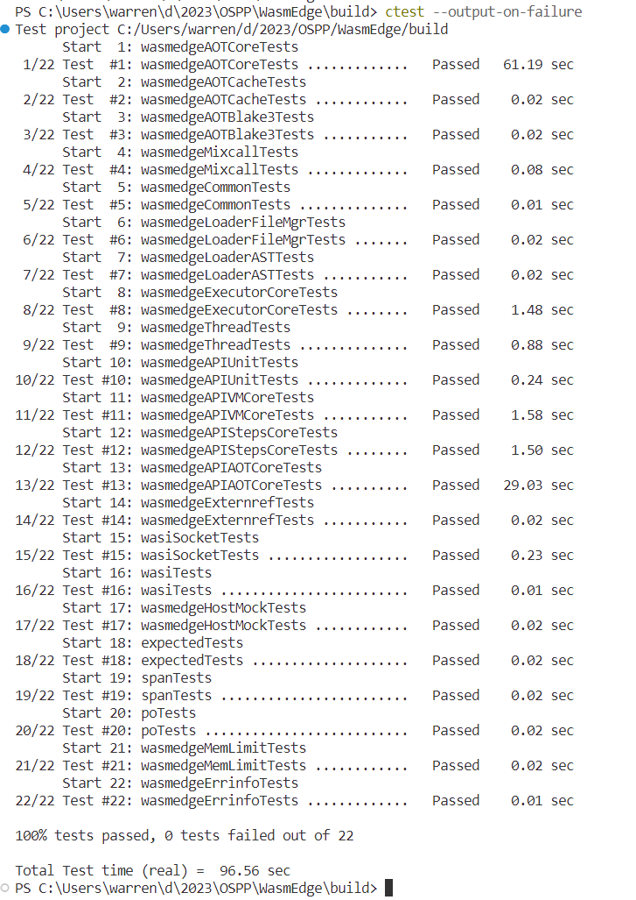

# OSPP 2023

I'll keep this readme file up to date during the whole process of OSPP 2023.

There are two branches:
- OSPP (current branch) for notes and logs.
- am009/msvc_support for development

Guideline: While solving compiler errors, split modifications into many small commits. When trying to organize modifications, use git rebase interactive to move similar commits together, and optionally squash them.

## Summary


## Log

2023-05-16 [OSPP 2023 Challenge](https://github.com/WasmEdge/WasmEdge/discussions/2452) 

2023-05-24 gtest, 

## Task

[Weekly Progress, Milestones](https://github.com/WasmEdge/WasmEdge/issues/2629)

[Project on OSPP Website](https://summer-ospp.ac.cn/org/prodetail/238830388?lang=zh&list=pro)

[OSPP feat: Enabling WasmEdge Compilation with MSVC Toolchain](https://github.com/WasmEdge/WasmEdge/issues/2437)

[OSPP 2023 Challenge](https://github.com/WasmEdge/WasmEdge/discussions/2452)


## Progress

- 2023-07-05 Start working on rewriting SIMD related parts. (MSVC: unroll SIMD to avoid gnu vector.)
- 2023-08-09 Finally leave the dilemma of SIMD.
- 2023-08-10 Find a bug in int128.h

### 2023-08-10 fabs error

In two test cases for `f32.abs`, 
    - Input 2139156962 (hex 0x7f80f1e2, NAN) (), expected output is the same
    - Input 4286640610 (hex 0xff80f1e2, -NAN) expected output is 2139156962 (hex 0x7f80f1e2, NAN), MSVC result 2143351266 (hex 0x7fc0f1e2 NAN). According to IEEE 754 fp, the highest bit of `fraction` is set by `std::fabs`.

This is confirmed by the following code:
```cpp
#include<array>
#include<iostream>
#include<cmath>


int main() {
    // 10000000000000ULL
    uint32_t before = 0x7f80f1e2;
    float before_f = reinterpret_cast<float&>(before);
    std::cout << "before: " << before << ", (" << before_f << std::endl;
    float after_f = std::fabs(before_f);
    uint32_t after = reinterpret_cast<uint32_t&>(after_f);;
    std::cout << "after: " << after << ", (" << after_f << std::endl;
    return 0;
}
/* MSVC
before: 2139156962, (nan
after: 2143351266, (nan
*/
/* g++
before: 2139156962, (nan
after: 2139156962, (nan
*/
```

[a intro to ieee 754](http://www.fredosaurus.com/notes-java/data/basic_types/numbers-floatingpoint/ieee754.html)


### 2023-08-10 Debug test suite

At `test\spec\spectest.cpp:468` (`SpecTest::run`) set conditional breakpoint: `_strcmpi(UnitName._Mydata, "float_misc") == 0`

### 2023-08-10 `test\api\APIUnitTest.cpp` `a parenthesized type followed by an initializer list is a non-standard explicit type conversion syntax`

https://stackoverflow.com/questions/33270731/error-c4576-in-vs2015-enterprise

Just remove the parentheses?

### 2023-08-09 avoid `std::swap` in `constexpr` function.

Because [`std::swap` is not marked as constexpr before c++20](https://stackoverflow.com/questions/60674939/why-isnt-stdswap-marked-constexpr-before-c20).

### 2023-08-09 `__restrict__` not found

In MSVC, use [`__restrict`](https://learn.microsoft.com/en-us/cpp/cpp/extension-restrict?view=msvc-170)

[Introduction to restrict](https://cellperformance.beyond3d.com/articles/2006/05/demystifying-the-restrict-keyword.html).

> The restrict keyword can be considered an extension to the strict aliasing rule. It allows the programmer to declare that pointers which share the same type (or were otherwise validly created) do not alias eachother.

```
E:\OSPP\WasmEdge\lib\host\wasi\wasifunc.cpp(368): error C2734: '__restrict__': 'const' object must be initialized if not 'extern'
E:\OSPP\WasmEdge\lib\host\wasi\wasifunc.cpp(368): error C3531: '__restrict__': a symbol whose type contains 'auto' must have an initializer
E:\OSPP\WasmEdge\lib\host\wasi\wasifunc.cpp(368): error C2146: syntax error: missing ';' before identifier 'Argc'
```

### 2023-08-09 `'byte': ambiguous symbol`

```
E:\OSPP\WasmEdge\include\experimental/span.hpp(250): error C2872: 'byte': ambiguous symbol
C:\Program Files (x86)\Windows Kits\10\include\10.0.19041.0\shared\rpcndr.h(191): note: could be 'unsigned char byte'
C:\Program Files\Microsoft Visual Studio\2022\Community\VC\Tools\MSVC\14.34.31933\include\cstddef(28): note: or       'std::byte'
E:\OSPP\WasmEdge\include\host/wasi/environ.h(850): note: see reference to function template instantiation 'auto cxx20::as_writable_bytes<uint8_t,18446744073709551615>(cxx20::span<uint8_t,18446744073709551615>) noexcept' being compiled
E:\OSPP\WasmEdge\include\experimental/span.hpp(229): warning C4623: 'cxx20::span<const uint32_t,1>': default constructor was implicitly defined as deleted
E:\OSPP\WasmEdge\include\host/wasi/environ.h(854): note: see reference to class template instantiation 'cxx20::span<const uint32_t,1>' being compiled
```

### `[[gnu::vector_size(16)]]` related

I found another important issue that, MSVC does not support attribute `[[gnu::vector_size(16)]]`, and [there seems no direct replacement](https://stackoverflow.com/questions/29435394/replacement-of-typedef-int64-t-x-t-attribute-vector-size16). I found this [OpenMP SIMD Extension](https://learn.microsoft.com/en-us/cpp/parallel/openmp/openmp-simd?view=msvc-170) which is very different from the extension.

- For example, this code, MSVC first report a warning that the attribute `[[gnu::vector_size(16)]]` is unknown. Probably `int32x8_t` directly becomes `int32_t`

https://github.com/WasmEdge/WasmEdge/blob/9a9401fc1413e895a9588533d3cf05d5f389eb4e/include/executor/engine/binary_numeric.ipp#L581-L593

- the arithmetic of these vector types seems to be used a lot (`EV1 * EV2` in the above code, in the following code, and many more), which will do the arithmetic for each element in the array according to [gcc vector extension](https://gcc.gnu.org/onlinedocs/gcc-4.6.1/gcc/Vector-Extensions.html#Vector-Extensions). If MSVC equivalent cannot be found, probably we have to rewrite all these operations for MSVC? We can either rewrite these using loop and hope for the compiler to optimize it to use SIMD instructions, or implement a class (or structure) that override these operations support these operations? I don't know...

https://github.com/WasmEdge/WasmEdge/blob/56a2f13ef61a912888a25e4b2cb168b5090533b4/include/executor/engine/unary_numeric.ipp#L202-L209

#### reimplement the unrolled version for SIMD instructions

Background: Because MSVC does not support `gnu::vector_size` or equivalent, we need to implement unrolled version of SIMD instructions. Many implementations are in `*.ipp` files, and we can create MSVC version of these ipp files, use `#ifdef` to include them.

According to the [specification](https://github.com/WebAssembly/simd/blob/main/proposals/simd/SIMD.md ), rewrite each part of the instructions.

The first decision is to make these vector type using std::array. e.g., `using int8x16_t = std::array<int8_t, 16>;`. The reason why not choose plain array type, is related to the implementation of `ValVariant`. Using plain array type will cause some wired errors.

|instruction|specification and reference|
|-|-|
|q15mulr_sat_s|[q15mulr_sat_s](https://github.com/WebAssembly/simd/blob/a78b98a6899c9e91a13095e560767af6e99d98fd/proposals/simd/SIMD.md#saturating-integer-q-format-rounding-multiplication)|
|replace_lane|[replace_lane](https://github.com/WebAssembly/simd/blob/main/proposals/simd/SIMD.md#replace-lane-value)|
|i8x16.popcnt|[i8x16.popcnt](https://github.com/WebAssembly/simd/blob/main/proposals/simd/SIMD.md#lane-wise-population-count) and [this answer](https://stackoverflow.com/a/30692782)|

The `WasmEdge::Executor::detail::vectorSelect` also can not be used, because the ternary operator:

> In C++, the ternary operator ?: is available. a?b:c, where b and c are vectors of the same type and a is an integer vector with the same number of elements of the same size as b and c, computes all three arguments and creates a vector {a[0]?b[0]:c[0], a[1]?b[1]:c[1], …}.
> (from https://gcc.gnu.org/onlinedocs/gcc/Vector-Extensions.html )

#### 2023-07-31 bulk replace `[[gnu::vector_size(16)]]` to `std::array`

using vscode's replace to replace the definition of some type with `gnu::vector_size` into `std::array`:

- `using ([^\s]+) \[\[gnu::vector_size\(([0-9]+)\)\]\] = ([^\s;]+);` -> `using $1 = SIMDArray<$3, $2>`
- ~~`using ([^\s]+) \[\[gnu::vector_size\(([0-9]+)\)\]\] = ([^\s;]+);` -> `using $1 = std::array<$3, ($2 / sizeof($3))>;`~~
    - `std::array<([a-zA-Z0-9_]+), \(([0-9]+) / sizeof\(([a-zA-Z0-9_]+)\)\)>` -> `SIMDArray<$1, $2>`
- ~~`using ([^\s]+) \[\[gnu::vector_size\(([0-9]+)\)\]\] = ([^\s;]+);` -> `constexpr int32_t Len = $2 / sizeof($3);\n  using $1 = std::array<$3, Len>;`~~

### 2023-07-10 notes on `__x86_64__`

There are a few places where we assume `__x86_64__` is not defined under MSVC. (still defined when using clang-cl) (In MSVC, it seems to be `_WIN64` or `_M_X64`?). 
- `lib/aot/compiler.cpp`. It will enable some llvm x86_64 intrinsics (like `LLVM::Core::X86SSE41RoundPs`) if `__x86_64__` is defined.
- `include\common\int128.h` so that the class version instead of `__int128` version will be used. This might actually be a good thing because these code simulates int128 behavior using a class and MSVC does not have the int128 type.
    - P.S., Probably we should use [`__SIZEOF_INT128__`](https://stackoverflow.com/questions/18531782/how-to-know-if-uint128-t-is-defined) to check for the existence of `__int128` here? 

Besides, [clang-cl will also define `_MSC_VER` unless a `-fmsc-version=0` flag is provided](https://stackoverflow.com/questions/67406228/clang-on-windows-how-to-disable-the-default-msvc-compatibility).

### 2023-07-10 `lib\executor\engine\proxy.cpp` array designator initializer

[array designator initializer is supported in clang-cl but not in MSVC](https://learn.microsoft.com/en-us/answers/questions/1165265/c-array-designator-initializer-does-not-work-with?orderby=oldest)

We can use [the syntax of aggregate initialization](https://stackoverflow.com/questions/13056366/can-i-initialize-a-union-in-a-mem-initializer) by commenting out the member initializer, or [write constructor](https://stackoverflow.com/questions/321351/initializing-a-union-with-a-non-trivial-constructor) for each union member.


### 2023-07-10 `[[gnu::visibility("default")]]`

In `include\api\wasmedge\wasmedge.h` there is a WASMEDGE_CAPI_EXPORT that does basically the same thing. However, the macro `WASMEDGE_COMPILE_LIBRARY` is only defined in the api directory (in `lib\api\CMakeLists.txt:5`).


There is a [gcc wiki](https://gcc.gnu.org/wiki/Visibility) talking about this. But the macro definition is too complex. According to [this tutorial](https://medium.com/ai-innovation/how-to-create-c-c-dynamic-link-libraries-in-windows-28abefc988c9), `__attribute__ ((dllimport))` seems not necessary. [Here](https://chromium.googlesource.com/chromium/llvm-project/llvm/lib/Fuzzer/+/024d10da8a13ee7c61e0f47914dc845edb70ec2f%5E%21/) is a place where similar macro `ATTRIBUTE_INTERFACE` like the following are used.

```
#ifdef _MSC_VER
    #define WASMEDGE_EXPORT __declspec(dllexport)
#else
    #define WASMEDGE_EXPORT [[gnu::visibility("default")]]
#endif
```

### 2023-07-08 int128Test.cpp `error C2593: 'operator ~' is ambiguous`

Somehow, the 32bit related logic in `include\common\int128.h` is compiled, probably because the `defined(__x86_64__)` is false. In MSVC, it seems to be `_WIN64` or `_M_X64`.

There seems [no __int128 equivalent in MSVC](https://stackoverflow.com/questions/6759592/how-to-enable-int128-on-visual-studio)

[_MSC_VER is also defined by MSVC clang](https://stackoverflow.com/questions/67406228/clang-on-windows-how-to-disable-the-default-msvc-compatibility) and 

some unused code: 
```C++
  friend constexpr uint128_t operator*(uint128_t LHS, long long RHS) noexcept {
    return LHS * uint128_t(RHS);
  }
  friend constexpr uint128_t operator*(long long LHS, uint128_t RHS) noexcept {
    return uint128_t(LHS) * RHS;
  }
```

### 2023-07-06 attribute 'gnu::always_inline' is not recognized

The replacement seems to be [`__forceinline`](https://learn.microsoft.com/en-us/cpp/cpp/inline-functions-cpp?view=msvc-170)

> You can't force the compiler to inline a particular function, even with the __forceinline keyword. When you compile with /clr, the compiler won't inline a function if there are security attributes applied to the function.

### 2023-06-30 C++20 designated initializer

<!-- these days working on a compilable version, however stopped by some C++ template error that is hard to understand.  -->

https://stackoverflow.com/questions/19191211/constructor-initialization-of-a-named-union-member


### 2023-06-30 overriding '/EHs' with '/EHs-'

[cmake automatically adds /EHsc](https://cmake.org/pipermail/cmake/2010-December/041638.html) and LLVM add /EHs-c-


### gtest build error

gtest have `-WX`(regard all warning as error) in their compiler flags (in `build\_deps\gtest-src\googletest\cmake\internal_utils.cmake:75`), but there are still many warnings (which become errors). 

Current solution: supress many warnings in `WasmEdge\test\CMakeLists.txt`.


##### error C3861: '__builtin_clzll': identifier not found

In `include/common/int128.h` `clz()`, an intrinsic is used.

change according to `thirdparty\blake3\blake3_impl.h` 

https://stackoverflow.com/questions/355967/how-to-use-msvc-intrinsics-to-get-the-equivalent-of-this-gcc-code

##### error C3861: '__builtin_unreachable': identifier not found

[`__assume(0)` can indicate unreachable code path](https://learn.microsoft.com/en-us/cpp/intrinsics/assume?view=msvc-170#remarks)

[another discussion](https://stackoverflow.com/questions/60802864/emulating-gccs-builtin-unreachable-in-visual-studio)

##### error C3861: '__builtin_expect': identifier not found

[visual studio - likely/unlikely equivalent for MSVC - Stack Overflow](https://stackoverflow.com/questions/1440570/likely-unlikely-equivalent-for-msvc)

Temporarily use the solution here: https://blog.csdn.net/celestialwy/article/details/1352891

https://stackoverflow.com/a/42136453

[To use ifdef to detect MSVC](https://stackoverflow.com/questions/5850358/is-there-a-preprocessor-define-that-is-defined-if-the-compiler-is-msvc)

https://github.com/DLTcollab/sse2neon/issues/384

https://github.com/getsentry/symsynd/blob/master/demangle/llvm/Support/Compiler.h


### log other issues

1. Equivalent flag for `-Wall` `-Wno-xxx` 

    Reference: [MSVC C++ Warning levels](https://learn.microsoft.com/en-us/cpp/build/reference/compiler-option-warning-level?view=msvc-170). 

    - For `-Wall` there is `/Wall`.
    - For `-Wextra`, there seems no equivalent flag?
    - For `-Werror`, there is `/WX`.

1. Use `if(CMAKE_CXX_COMPILER_ID MATCHES "MSVC")` or `if(MSVC)` in cmake.

    It seems better to use `if(MSVC)`. [ref](https://github.com/unittest-cpp/unittest-cpp/issues/160)

1. How to set MSVC output language to English?

    Install and uninstall related language pack in visual studio installer.

    According to [here](https://stackoverflow.com/questions/2286216/how-to-change-msbuild-error-message-language), Set environment variable `VSLANG=1033`

1. How to debug cmake: [use trace related flags](https://stackoverflow.com/questions/38864489/how-to-trace-cmakelists-txt)

    [CMake cmdline reference](https://cmake.org/cmake/help/v3.5/manual/cmake.1.html)


## Challenge

https://github.com/WasmEdge/WasmEdge/discussions/2452

1. Challenge1: Use Clang on Windows to build and run tests
1. Challenge2: Try using MSVC to build.


### Challenges

### Challenge2: Try using MSVC to build

To use MSVC to build, I installed MSVC 14.34.31933, and removed `$Env:CC = "clang-cl"` and `$Env:CXX = "clang-cl"` in the build script, and add `-vcvars_ver=14.34.31933`.

```
# Remove-Item -LiteralPath "build" -Force -Recurse
$vsPath = (&"C:\Program Files (x86)\Microsoft Visual Studio\Installer\vswhere.exe" -latest -property installationPath)
Import-Module (Join-Path $vsPath "Common7\Tools\Microsoft.VisualStudio.DevShell.dll")
Enter-VsDevShell -VsInstallPath $vsPath -SkipAutomaticLocation -DevCmdArguments "-arch=x64 -host_arch=x64 -winsdk=10.0.19041.0 -vcvars_ver=14.34.31933"
$llvm_dir = "C:\\Users\\warren\\my_programs\\LLVM-13.0.1-win64\\lib\\cmake\\llvm"
# $Env:CC = "cl.exe"
# $Env:CXX = "cl"

cmake -Bbuild -GNinja -DCMAKE_SYSTEM_VERSION="10.0.19041.0" -DCMAKE_MSVC_RUNTIME_LIBRARY=MultiThreadedDLL "-DLLVM_DIR=$llvm_dir" -DWASMEDGE_BUILD_TESTS=ON -DWASMEDGE_BUILD_PACKAGE="ZIP" .
cmake --build build
```

the first error encountered is:
```
cl : Command line error D8021 : invalid numeric argument '/Wextra'
```

TODO:
1. When the compiler is MSVC, not add unsupported flags to `WASMEDGE_CFLAGS`, and find equivalent flags instead.
1. try to find equivalent code in MSVC for [the `int128.h` issue](https://github.com/WasmEdge/WasmEdge/issues/2419)

### Challenge1: Use Clang on Windows to build and run tests


#### Install Dependencies & Build

CMake is already installed on my computer.
1. Install latest cmake and select the option that add cmake to path.
1. Download the LLVM fork from https://github.com/WasmEdge/llvm-windows . **Do not use llvm official release and do not add its `bin` to path**.
1. Open `LLVM-13.0.1-win64\lib\cmake\llvm\LLVMExports.cmake` and search for `diaguids`, and change from `Enterprise` to `Community`.
1. Use Visual Studio Installer to install Windows SDK and MSVC. Change Win 11 SDK to Win 10 SDK 10.0.19041.0. **Select Clang 15 and use this as compiler!!**
1. `vswhere` seems to be already included in Visual Studio Installer. Change its occurrence to absolute path.

Clone the code and check out to `0.12.0`. Follow the instructions: https://wasmedge.org/book/en/contribute/build_from_src/windows.html but add some more cmake flags.

Build script below:
```
$vsPath = (&"C:\Program Files (x86)\Microsoft Visual Studio\Installer\vswhere.exe" -latest -property installationPath)
Import-Module (Join-Path $vsPath "Common7\Tools\Microsoft.VisualStudio.DevShell.dll")
Enter-VsDevShell -VsInstallPath $vsPath -SkipAutomaticLocation -DevCmdArguments "-arch=x64 -host_arch=x64 -winsdk=10.0.19041.0 -vcvars_ver=14.33.31629"

$llvm_dir = "C:\\Users\\warren\\my_programs\\LLVM-13.0.1-win64\\lib\\cmake\\llvm"
$Env:CC = "clang-cl"
$Env:CXX = "clang-cl"

cmake -Bbuild -GNinja -DCMAKE_SYSTEM_VERSION="10.0.19041.0" -DCMAKE_MSVC_RUNTIME_LIBRARY=MultiThreadedDLL "-DLLVM_DIR=$llvm_dir" -DWASMEDGE_BUILD_TESTS=ON -DWASMEDGE_BUILD_PACKAGE="ZIP" .
if ($?) {
    cmake --build build
}

if ($?) {
    $Env:PATH += ";$pwd\\build\\lib\\api"
    cd build
    ctest --output-on-failure
    cd ..
}
```

the output saved using `2>&1 > out.txt` are uploaded as `clang-build.txt`.

**installing LLVM**
during decompressing the llvm zip file, I notice that `clang-cl.exe` `clang++.exe` are actually symbolic links. If I use explorer to decompress the file, the symbolic links seems broken. I started 7zip file manager with administrator privilege to decompress it, and the result seems to replace the symlink with another copy of the target.

#### test

Follow https://wasmedge.org/book/en/contribute/build_from_src/windows.html#run-tests and all test passed.



##### `Cannot Compile simple program using std::filesystem`

tldr: Do not add the downloaded clang 13 to compile (do not add it to PATH), use clang 15 from Visual Studio Installer instead!!! (it will be automatically added to path when you enter dev shell.)

A few days ago, I can successfully compile, but when I come back to this today, this new error occurred. To debug cmake output, I added `--debug-output` to cmake flags. I found a line in CMakeError.log.

```
In file included from C:\Program Files\Microsoft Visual Studio\2022\Community\VC\Tools\MSVC\14.35.32215\include\filesystem:9:
C:\Program Files\Microsoft Visual Studio\2022\Community\VC\Tools\MSVC\14.35.32215\include\yvals_core.h(807,1): error: static_assert failed "Error in C++ Standard Library usage."
_EMIT_STL_ERROR(STL1000, "Unexpected compiler version, expected Clang 15.0.0 or newer.");
^~~~~~~~~~~~~~~~~~~~~~~~~~~~~~~~~~~~~~~~~~~~~~~~~~~~~~~~~~~~~~~~~~~~~~~~~~~~~~~~~~~~~~~~

C:\Program Files\Microsoft Visual Studio\2022\Community\VC\Tools\MSVC\14.35.32215\include\yvals_core.h(462,5): note: expanded from macro '_EMIT_STL_ERROR'

    static_assert(false, "Error in C++ Standard Library usage.")

    ^             ~~~~~

1 error generated.

ninja: build stopped: subcommand failed.
```

`filesystem` header is actually found. I need to downgrade MSVC version. But uninstall latest version seems to introduce more problem, so keep the newer version and try to specify MSVC version used. Downgrade to MSVC v142 (2019) will trigger another error, so I tried several previous version of MSVC v143.

According to `Get-Help Enter-VsDevShell` and `VsDevCmd.bat /help`, add `-vcvars_ver=14.29.30133`. Open `C:\Program Files\Microsoft Visual Studio\2022\Community\VC\Tools\MSVC` to find out MSVC versions. Finally `14.33.31629` can work.

```
Enter-VsDevShell -VsInstallPath $vsPath -SkipAutomaticLocation -DevCmdArguments "-arch=x64 -host_arch=x64 -winsdk=10.0.19041.0 -vcvars_ver=14.33.31629"
```

However, Some tests failed.

```
The following tests FAILED:
          8 - wasmedgeExecutorCoreTests (Failed)
         11 - wasmedgeAPIVMCoreTests (Failed)
         12 - wasmedgeAPIStepsCoreTests (Failed)
Errors while running CTest
```

|     MSVC Version    | CMake | Build? | Test? | Errors                                                           |
|:-------------------:|:-----:|:------:|:-----:|------------------------------------------------------------------|
|     14.31.31103     |   √   |    ×   |   -   | undefined symbol: __std_init_once_link_alternate_names_and_abort |
|     14.32.31326     |   √   |    √   |   ×   | ExecutorCoreTests APIVMCoreTests APIStepsCoreTests failed        |
|     14.33.31629     |   √   |    √   |   ×   | ExecutorCoreTests APIVMCoreTests APIStepsCoreTests failed        |
|     14.34.31933     |   ×   |    -   |   -   | Cannot Compile simple program using std::filesystem              |
| 14.35.32215(latest) |   ×   |    -   |   -   | Cannot Compile simple program using std::filesystem              |

After A few days' trying and error, I finally find out that, I should't use the downloaded clang 13 to compile, use clang 15 from Visual Studio Installer instead!!!

#### Errors I encountered (reverse order)

##### WasmEdge\include\common/enum_errcode.hpp(79): error C7555: use of designated initializers requires at least '/std:c++20'

2023-05-24 

1. add `/std:c++17` to `WASMEDGE_CFLAGS`
2. add `target_compile_features(${TARGET_NAME} PRIVATE cxx_std_17)` according to [here](https://stackoverflow.com/questions/45688522/how-to-enable-c17-in-cmake) 
3. `set(CMAKE_CXX_STANDARD 17)`  or `-DCMAKE_CXX_STANDARD=17`

TODO


##### No tests were found!!!

2023-05-13 When I check out to latest tag: `0.12.1`, I got this error.


##### some test failed due to `std::filesystem`


##### 2023-05-10 summary

- The MSVC runtime library for LLVM should be the same with WasmEdge.
- There is an hard-coded library path for `diaguids.lib` in LLVM's cmake file.
To solve these two issue without upgrading llvm version, it seems that [forking llvm](https://github.com/WasmEdge/llvm-windows) and recompile is the only way.

##### `lld-link: error: undefined symbol: __std_init_once_link_alternate_names_and_abort`

Previously my Visual Studio version is 2019. Upgrading to 2022 solves the issue.

According to [here](https://stackoverflow.com/questions/73749984/qt-6-3-2-compilation-issue)
> it could not find this new function: __std_init_once_link_alternate_names_and_abort. This function is from STL's import library: msvcprt.lib and was only added in the VS 2022 version: 17.2.5.

##### `ninja: error: 'C:/Program Files/Microsoft Visual Studio/2022/Enterprise/DIA SDK/lib/amd64/diaguids.lib', needed by 'test/aot/wasmedgeAOTCoreTests.exe', missing and no known rule to make it`

Found a related issue: https://github.com/WasmEdge/WasmEdge/issues/1290

Edit `C:\Users\warren\my_programs\LLVM-13.0.1-win64\lib\cmake\llvm\LLVMExports.cmake` and search for `diaguids`, and change from `Enterprise` to `Community`.


##### `llvm-mt: error: no libxml2`

tldr: this error disappeared after my environment changed, but if it exist, you can add the flags.

There is an error said: `llvm-mt: error: no libxml2`. This [issue](https://discourse.llvm.org/t/cannot-cmake-self-hosted-clang-on-windows-for-lack-of-libxml2/58793), 

Changing cmake version doesn't seems to work.
~~I decided to first upgrade my cmake (from 3.21.1) to latest([3.26.3](https://github.com/Kitware/CMake/releases/download/v3.26.3/cmake-3.26.3-windows-x86_64.msi)).~~

- https://github.com/KDAB/GammaRay/issues/458

Finally I think I have to add the following to cmake flags:
```
-DCMAKE_EXE_LINKER_FLAGS="/manifest:no" -DCMAKE_MODULE_LINKER_FLAGS="/manifest:no" -DCMAKE_SHARED_LINKER_FLAGS="/manifest:no"
```
